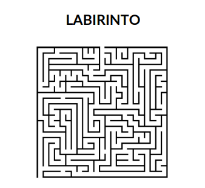

# Etapa 1. Arrays bidimensionais, arquivos e recursão

Na primeira etapa do Desafio do Laboratório II, você deve criar um
programa que simule um labirinto. No nosso sistema, o labirinto será uma
determinada estrutura composta por caracteres. No labirinto, posições com 'X'
indicam que não é possível passar, enquanto posições com ' ' (espaço) indicam
que é possível a passagem. O local de destino está marcado no labirinto com a
letra 'D'. Um exemplo de labirinto pode ser visto abaixo:

 XXXXXXXXX XXXXXX
X XXXXXXXXX X XXXX
X XXXXXXX XXX XXXX
XXX XXXXXX XXX XXXX
XXX XX XXXX
XXX XX X XXXXX XXX
XXXXXX X XXXXXX X
XXXXXX XXXXXX XXXD

O labirinto será um array bidimensional de caracteres. Para a criação do
labirinto, seu programa deve ler um arquivo com extensão txt que contém os
caracteres correspondentes ao labirinto. Depois de ler o arquivo, você deve passar
seu conteúdo para um array bidimensional de caracteres. Desta forma, o local de
entrada no labirinto sempre será a posição [0][0] do array.

